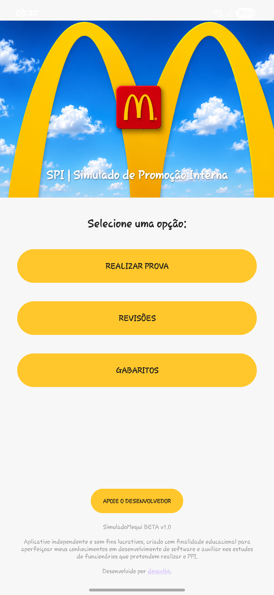
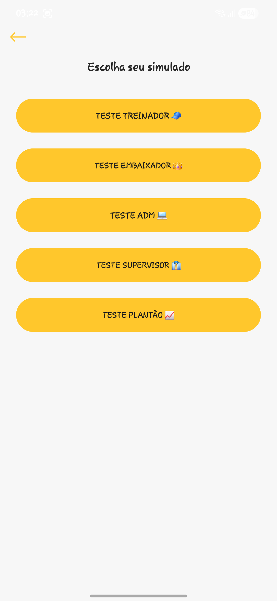
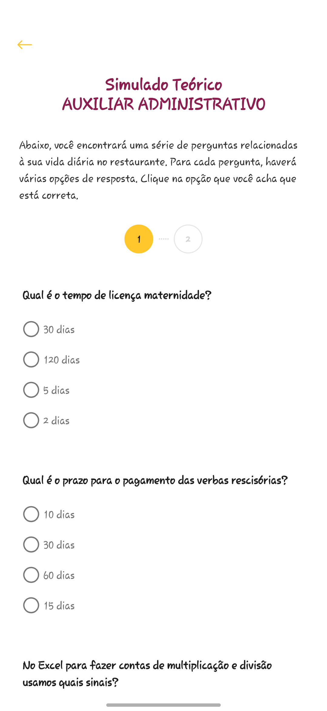
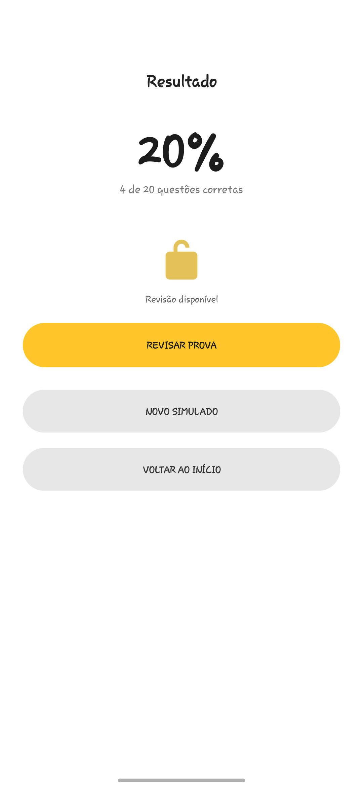
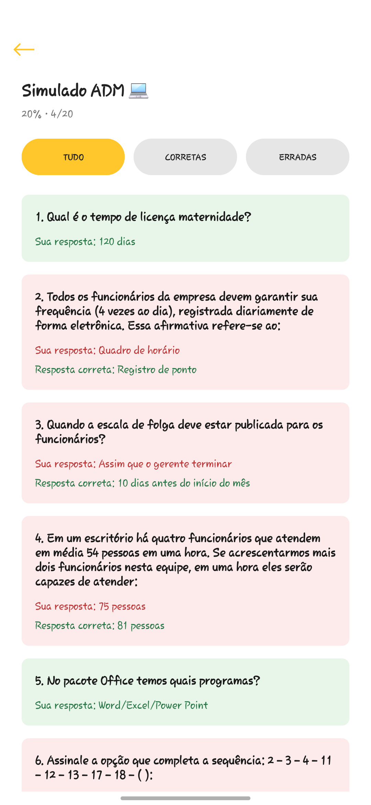
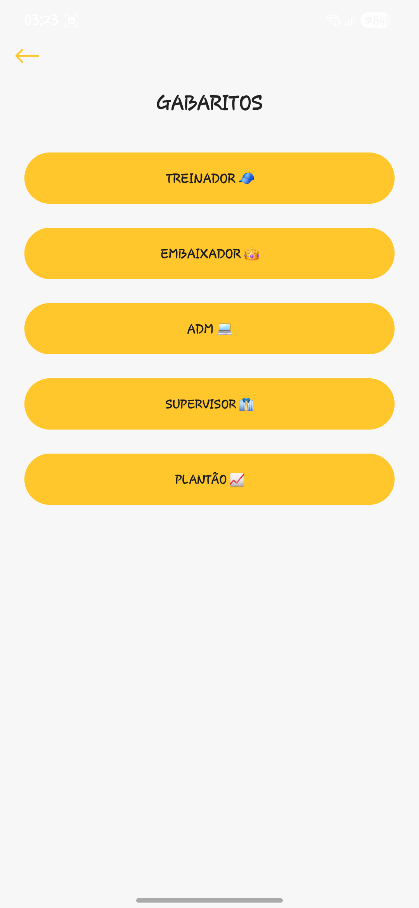

# 📱 PPI Simulado

PPI Simulado (Processo de Promoção Interna Simulado).

Aplicativo Android desenvolvido para auxiliar nos estudos e na preparação para provas de conhecimento operacional.

O projeto permite realizar simulados de diferentes cargos, consultar gabaritos e revisar o desempenho após cada tentativa.

> Projeto independente, desenvolvido para fins educacionais e de aprendizado em desenvolvimento Android.

---

## 📸 Demonstração

### Tela inicial

  

### Escolha do simulado

  

### Realização da prova

  

### Resultado

  

### Revisão das respostas

  

### Gabaritos

  

---

## 🚀 Funcionalidades

- Simulados para diferentes cargos
- Questões de múltipla escolha
- Paginação das questões
- Correção automática
- Histórico dos últimos resultados
- Revisão de respostas corretas e incorretas
- Filtro de questões na revisão
- Gabaritos separados por cargo
- Pesquisa nos gabaritos
- Funcionamento local, sem necessidade de cadastro

---

## 🛠️ Tecnologias

- Java
- Android SDK
- XML
- Android Studio
- Git e GitHub

---

## 🤖 Desenvolvimento com auxílio de IA

Este projeto foi desenvolvido com forte auxílio de Inteligência Artificial na implementação do código.

Minha participação envolveu a concepção do aplicativo, definição das funcionalidades e regras, organização do conteúdo, decisões de interface, testes, identificação de problemas e acompanhamento do desenvolvimento.

O projeto também faz parte do meu processo de aprendizado em Java e desenvolvimento Android.

---

## 📌 Status

**Versão atual:** PPI Simulado v1.0

Projeto funcional e disponível para testes através de APK.

  

---

## 👨‍💻 Desenvolvedor

Desenvolvido por **devaxl64** como projeto de estudo e portfólio.
